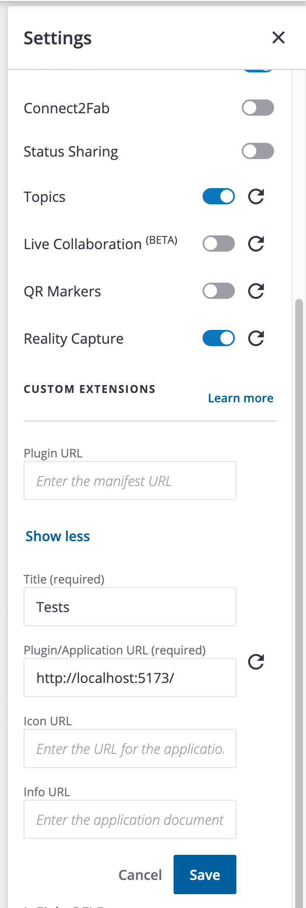
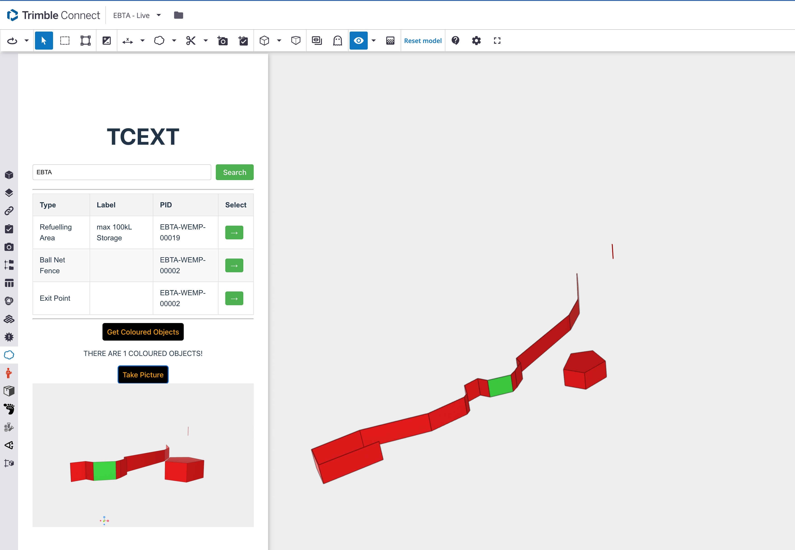
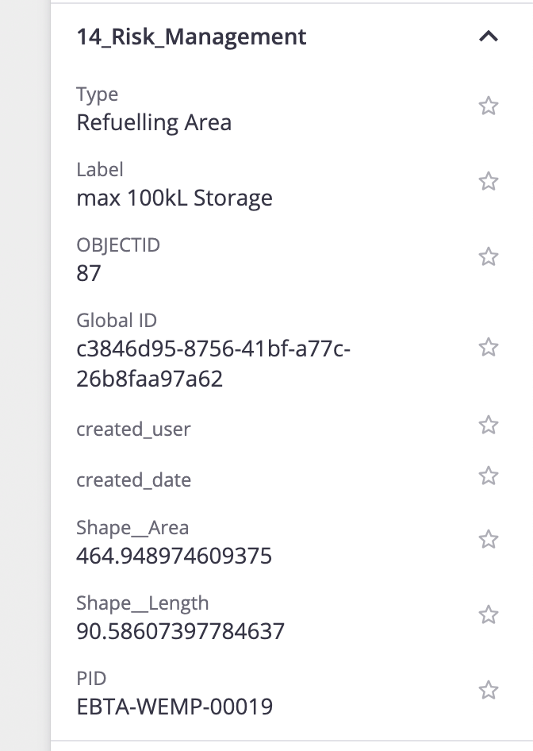

## Trimble Connect Extension Boilerplate

Built with ```npm create vite@latest```. 

```sh
git clone https://github.com/rayking99/trimble-vite-ext
cd trimble-vite-ext
npm install
npm run dev
```

Open your browser to Trimble Connect and input the following details: 

<div align="center">

</div>


--- 
This should produce the following in Trimble Connect

<div align="center">

</div>

---

## Cusomisation

The allowedKeys and filterOptions take strings as search fields... extend them as you like. 

```jsx
// src/Components/ObjectSearch.jsx
const allowedKeys = ["Type", "Label", "PID"]; // + 'OBJECTID'? 
const filterOptions = ["Type", "Label", "PID"]; // + 'OBJECTID'? 
```

<div align="center">

</div>
